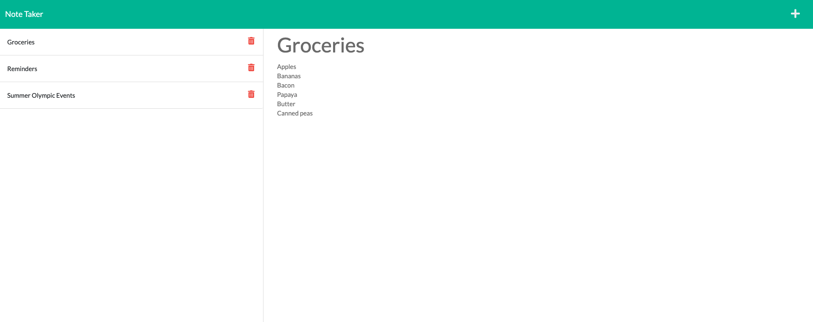

# Note Taker
## Description
This is a simple Note Taker that allows users to write and save notes. This application uses an Express.js back end and will save and retrieve note data from a JSON file.

## Functionality
When the note title and note text fields are entered, a save button appears on the top right of the screen. Clicking this button adds the note to the left of the page. Clicking the + button prompts an empty note for the user. Users can also click the trash icon to delete notes that are no longer needed.

## Built With

* [NPM](https://www.npmjs.com)
* [JavaScript](https://developer.mozilla.org/en-US/docs/Web/JavaScript)
* [HTML](https://developer.mozilla.org/en-US/docs/Web/HTML)
* [CSS](https://developer.mozilla.org/en-US/docs/Web/CSS)

## Deployed Link

* [See Live Site](https://enigmatic-sands-27905.herokuapp.com/notes)

## Authors

* **Trevor Coons** 

- [Link to Portfolio Site](https://trevcoons.github.io/trevors-portfolio/)
- [Link to Github](https://github.com/trevcoons)
- [Link to LinkedIn](www.linkedin.com/in/trevor-coons-2a948a104)

## Acknowledgments

Thanks to UC Berkeley Coding Bootcamp for teaching me JavaScript and NPM.